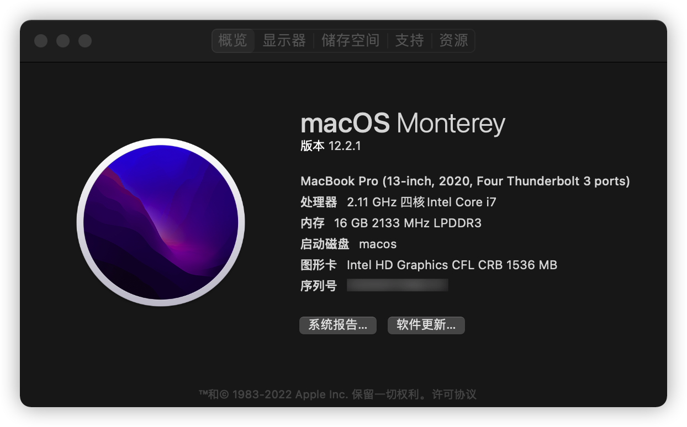

# matebook142020-OpenCore-Hackintosh

自用华为matebook14 2020款 黑苹果引导 Montory（Ventura Beta)使用,自用版本12.4

请注意机型 i510210U 

请定制三码

请定制三码

请定制三码

支持monterey12.4及ventura13.0 beta
ventura需要使用itlwm.kext + Heliport.app 作为临时解决方案进行intel网卡驱动see OpenIntelWireless/itlwm#784
monterey及ventura驱动需要自行设置itlwm及AirportItlwm

觉得有用请点个关注

本人小白，此efi仅作为个人备份及交流使用，有缘人觉得有用的可以参考下。config内acpi和系统引导等比较乱（比如还有我linux系统引导项）请勿见怪。

## 感谢

[matebook-13and14-OpenCore-Hackintosh](https://github.com/ske1996/matebook-13and14-OpenCore-Hackintosh)  
[Honor-MagicBook-X15-Hackintosh](https://github.com/fjallsarlon/Honor-MagicBook-X15-Hackintosh)  
[OC-little](https://github.com/daliansky/OC-little)
